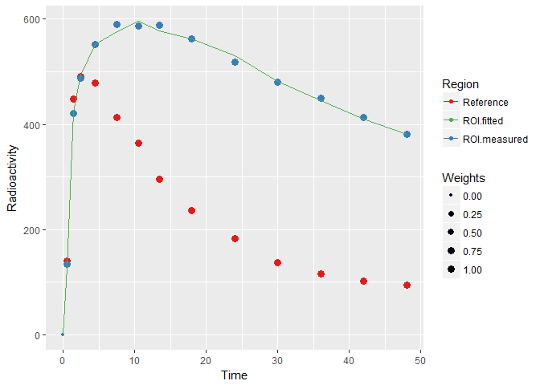
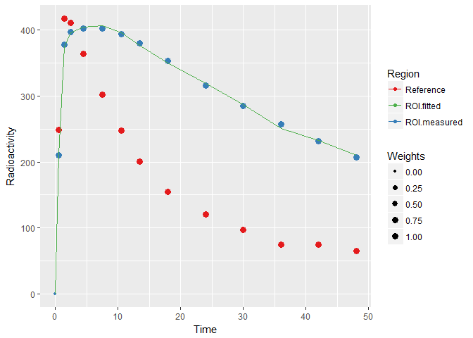
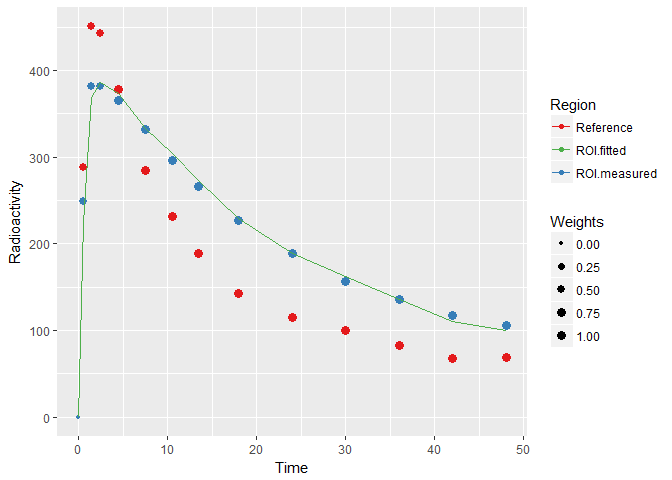

kinfitr : PET Kinetic Modelling using R
=======================================

Overview
--------

kinfitr is a a new package for PET Kinetic Modelling Using R. Aside from allowing me to use R more in my day-to-day work, the main goal of this package is to make it easier to perform more reproducible research in PET research. Furthermore, both kinfitr and the language it is written in, [R](https://cran.r-project.org), are free to download. Furthermore, the primary IDE for R, [RStudio](https://www.rstudio.com/), now comes with [R Notebooks](http://rmarkdown.rstudio.com/r_notebooks.html), which makes it particularly easy to generate reproducible reports.

Status
------

Please note that this package is currently under development. Many of the models have not been comprehensively tested to make sure that they produce the correct output in all situations. I plan to validate the performance of the kinfitr package against other kinetic modelling software at some point in the future. Please refer to the 'To Do' section below to check on what has not yet been done and is planned to be completed as soon as I have time.

Installation
------------

This package is currently only available on GitHub. It can be downloaded as follows:

``` r
# install.packages("devtools")  # If you do not already have devtools
devtools::install_github("mathesong/kinfitr")
```

Usage
-----

### Data Structure

Typically, in our Karolinska workflow, the way that we currently work is to extract all TACs for all ROIs into a wide format (i.e. each ROI is a column). For importing this into R, I make a large nested list object with the following layers of nesting:

-   Named list of PET measurements
    -   Data frame of all TACs of all ROIs + times + weights

``` r
library(tidyverse)
library(kinfitr)
library(stringr)
library(pander)

tacdat <- readRDS('../sch_tacdata/sch_tacdata.rds')
```

*(This data is unfortunately not available online at present. There will soon hopefully be a sample data included in the package)*

Thus the data looks as follows:

``` r
head( names(tacdat) )
```

    ## [1] "diky_1" "diky_2" "tper_1" "tper_2" "fnsm_1" "fnsm_2"

``` r
names(tacdat$tper_1)
```

    ## [1] "roisizes" "tacdata"

``` r
tacdat$tper_1$tacdata %>%
  select(times, weights, RefCBL, gmfslSTR) %>%
  head() %>%
  pander::pandoc.table()
```

<table style="width:53%;">
<colgroup>
<col width="12%" />
<col width="13%" />
<col width="12%" />
<col width="13%" />
</colgroup>
<thead>
<tr class="header">
<th align="center">times</th>
<th align="center">weights</th>
<th align="center">RefCBL</th>
<th align="center">gmfslSTR</th>
</tr>
</thead>
<tbody>
<tr class="odd">
<td align="center">0</td>
<td align="center">0</td>
<td align="center">0</td>
<td align="center">0</td>
</tr>
<tr class="even">
<td align="center">0.5003</td>
<td align="center">0.7147</td>
<td align="center">139.8</td>
<td align="center">133.5</td>
</tr>
<tr class="odd">
<td align="center">1.5</td>
<td align="center">0.6874</td>
<td align="center">448.7</td>
<td align="center">420.4</td>
</tr>
<tr class="even">
<td align="center">2.5</td>
<td align="center">0.686</td>
<td align="center">490.2</td>
<td align="center">487</td>
</tr>
<tr class="odd">
<td align="center">4.5</td>
<td align="center">0.7734</td>
<td align="center">478.6</td>
<td align="center">552</td>
</tr>
<tr class="even">
<td align="center">7.5</td>
<td align="center">0.7658</td>
<td align="center">412.9</td>
<td align="center">590.5</td>
</tr>
</tbody>
</table>

### Fitting a Model for a single TAC

I have aimed to make the package as intuitive as possible to use. Almost all input arguments of times or radioactivity concentrations are as numeric vectors.

``` r
times <- tacdat$tper_1$tacdata$times
tac <- tacdat$tper_1$tacdata$gmfslSTR
reference <- tacdat$tper_1$tacdata$RefCBL
weights <- tacdat$tper_1$tacdata$weights

srtmfit <- srtm(t_tac = times, reftac = reference,
      roitac = tac,weights = weights)

plot_kinfit(srtmfit)
```



Blood data is interpolated into an `input` data frame using the `blood_interp` command to make it easier to work with.

``` r
input <- blood_interp(t_blood = blooddata$Time.sec./60, 
                      blood = blooddata$Cbl.nCi.cc.,
                      t_plasma = plasmadata$Time.sec./60, 
                      plasma = plasmadata$Cpl.nCi.cc.,
                      t_parentfrac = parentdata$Times/60,
                      parentfrac = parentdata$Fraction)

onetcmout <- onetcm(times, tac, input, weights=weights)
plot_kinfit(onetcmout)
```

### Fitting a Model to Many TACs

#### Tidy and Arrange the Data

I have found, through some trial and error, that the best way for iterating through TACs using these methods are using nested data frames. I was inspired to do this following a [really excellent talk](https://www.youtube.com/watch?v=4MfUCX_KpdE) by Jenny Bryan from Plotcon 2016 - highly recommended if you are not familiar with (or skeptical of) such a data structure. For this purpose, we aim to chunk the data into a tidy format for which the size of each chunk which we want to work with at each stage: whether that is one TAC per person, or all TACs.

So, first we arrange and nest the data:

``` r
datdf <- map(tacdat, 'tacdata') %>%     # Extract tacdata from each element of the list
  
  bind_rows(.id = "PET") %>%     # Add the id of each PET measurement
  
  select(PET, Times = times, Weights=weights, FC = FSLSFC, PUT=FSLSPUT, 
         CAU=FSLSCAU, STR=FSLSSTR, RefCBL=RefCBL) %>%     # Choose and rename the relevant columns
  
  group_by(PET) %>%     # Chunk at the appropriate level
  
  nest(.key = tacs) %>%     # Nest
  
  mutate(Subjname = stringr::str_extract(PET, "(^[a-z]*)"),      # Extract the subject name
         PETNo = as.numeric(stringr::str_extract(PET, "\\d$")) )     # Extract the PET number

head(datdf)
```

    ## # A tibble: 6 × 4
    ##      PET              tacs Subjname PETNo
    ##    <chr>            <list>    <chr> <dbl>
    ## 1 diky_1 <tibble [14 × 7]>     diky     1
    ## 2 diky_2 <tibble [14 × 7]>     diky     2
    ## 3 tper_1 <tibble [14 × 7]>     tper     1
    ## 4 tper_2 <tibble [14 × 7]>     tper     2
    ## 5 fnsm_1 <tibble [14 × 7]>     fnsm     1
    ## 6 fnsm_2 <tibble [14 × 7]>     fnsm     2

What we want to do from here is to model the data using MRTM1 and MRTM2. Our plan is as follows:

-   MRTM1 fits BP<sub>ND</sub> and k2'

-   MRTM2 fits BP<sub>ND</sub> (using k2' from MRTM1 from a high-binding region)

So what we'll do:

-   Fit MRTM1 to one region of each PET Measurement

-   Fit MRTM2 to all regions of each PET Measurement

#### Fitting k2prime using MRTM1 using purrr::map

``` r
datdf <- datdf %>%
  
  group_by(PET) %>%     # Group by each PET measurement
  
  mutate(mrtm1_fit = map(tacs, ~mrtm1(t_tac = .x$Times, reftac = .x$RefCBL,      # Add MRTM1 fit column
                                      roitac = .x$STR, weights = .x$Weights))) %>%
  
  mutate(k2prime = map_dbl(mrtm1_fit, c('par', 'k2prime')))     # Extract k2prime from the fit output

plot_kinfit(datdf$mrtm1_fit[[1]])     # Plot the first TAC
```



#### Tidy Data: Gathering into Long format

Now we want to use the k2prime from fitting MRTM1 to the striatum for each PET measurement. Now, we want to chunk the data a little bit differently: we want to make the arrangement a little bit longer: each TAC which we wish to model should be a row.

``` r
longdat <- datdf %>%
  
  select(PET, tacs, Subjname, PETNo, k2prime) %>%  # Choose the columns we want
  
  unnest() %>%    # Unnest
  
  gather(Region, TAC, -PET, -Subjname, -PETNo, -Weights, 
         -Times, -k2prime, -RefCBL) %>%    # Gather the data into long-er format
  
  group_by(PET, Subjname, PETNo, Region, k2prime) %>%    # Group by more than just PET
  
  nest(.key=tacs)      # Nest the data again
```

This produces data which looks like this:

``` r
head(longdat)
```

    ## # A tibble: 6 × 6
    ##      PET Subjname PETNo Region   k2prime              tacs
    ##    <chr>    <chr> <dbl>  <chr>     <dbl>            <list>
    ## 1 diky_1     diky     1     FC 0.1298935 <tibble [14 × 4]>
    ## 2 diky_2     diky     2     FC 0.1366051 <tibble [14 × 4]>
    ## 3 tper_1     tper     1     FC 0.1202574 <tibble [14 × 4]>
    ## 4 tper_2     tper     2     FC 0.1137329 <tibble [14 × 4]>
    ## 5 fnsm_1     fnsm     1     FC 0.1741568 <tibble [14 × 4]>
    ## 6 fnsm_2     fnsm     2     FC 0.1769399 <tibble [14 × 4]>

For which the TACs nested object looks like this:

``` r
head( longdat$tacs[[1]] )
```

    ## # A tibble: 6 × 4
    ##       Times  Weights   RefCBL      TAC
    ##       <dbl>    <dbl>    <dbl>    <dbl>
    ## 1 0.0000000 0.000000   0.0000   0.0000
    ## 2 0.5002667 0.695104 249.0621 203.4480
    ## 3 1.5002667 0.687934 417.1702 339.1461
    ## 4 2.5002667 0.687535 410.7063 344.8662
    ## 5 4.5002667 0.767929 364.4055 331.6183
    ## 6 7.5002667 0.765012 302.5098 301.6385

#### Fitting MRTM2 using purrr::pmap

This function evaded me for a little while, but it's really incredible. While purrr::map iterates over elements within lists, purrr::pmap iterates over elements within infinitely many lists. In theory, we don't really need it here, but it becomes really useful when using stuff in several different nestings (i.e. a column of nested blood input data frames, a column of TACs and a column containing a fit object containing the fitted delay).

First we define a function for the iteration:

``` r
dofit_mrtm2 <- function(tacs, k2prime) {
  mrtm2(t_tac = tacs$Times, reftac = tacs$RefCBL, 
            roitac = tacs$TAC, weights = tacs$Weights,
            k2prime = k2prime)
}
```

... and then we apply it:

``` r
longdat <- longdat %>%

  mutate(fit_mrtm2 = pmap(list(tacs, k2prime), dofit_mrtm2)) %>%

  mutate(bp_mrtm2 = map_dbl(fit_mrtm2, c('par', 'bp')))


plot_kinfit(longdat$fit_mrtm2[[6]])
```



In this way, we can run several different models on the data, keep the fits in their own separate columns, and plot them at will. And we can do all of this within the tidyverse paradigm.

#### Using purrr::pmap for models using arterial input

To give an example for models with arterial input, a recent example first fitted 2TCM. These fits were saved in a column called delayFit. Then the fitted delay and vB from these fits were used for a new fitting.

``` r
# Function

fit2tcm <- function(tacs, input, delayFit) {
  twotcm(t_tac = tacs$Times/60, tac = tacs$TAC, input = input, inpshift = delayFit$par$inpshift,
         vB=delayFit$par$vB, frameStartEnd=c(1,33), weights=tacs$Weights)
}


# Iteration

longdat <- longdat %>%
  
  # 2TCM using fitted vB and delay
  mutate(fit_2tcm= pmap(list(tacs, input, WB_delay), fit2tcm)) %>%
  mutate(Vt_2tcm = purrr::map_dbl(fit_2tcm, c('par', 'Vt')))
```

Implemented Models
------------------

**Reference Region Models**

-   Simplified Reference Tissue Model (SRTM) *(Lammertsma & Hume, 1996)*

-   Non-Invasive Logan Plot *(Logan et al., 1996)*

-   Non-Invasive Multilinear Logan Plot *(Turkheimer et al., 2003)*

-   Ichise Multilinear Reference Tissue Model 1 (MRTM1) *(Ichise et al., 2003)*

-   Ichise Multilinear Reference Tissue Model 2 (MRTM2) *(Ichise et al., 2003)*

-   Patlak Reference Tissue Model *(Patlak & Blasberg, 1985)*

**Models Requiring Arterial Input**

-   One-Tissue Compartment Model

-   Two-Tissue Compartment Model

-   Logan Plot *(Logan et al., 1990)*

-   Multilinear Logan Plot *(Turkheimer et al., 2003)*

-   Ichise Multilinear Analysis 1 (MA1) *(Ichise et al., 2002)*

-   Ichise Multilinear Analysis 2 (MA2) *(Ichise et al., 2002)*

-   Patlak Plot *(Patlak et al., 1983)*

**Other Models**

-   Simultaneous Estimation of Non-Displaceable Binding (SIME) *(Ogden et al., 2015)*

To-Do
-----

**General**

-   Validate model output against other software

    -   Reference models output very similar to our group's in-house MATLAB tools

    -   Arterial models produce reasonable values, but not yet fully validated

    -   Irreversible methods completely unvalidated (no data to try these out on)

-   ~~Write up a tidyverse workflow for the README for models with arterial input~~

-   Add some sample data for testing and for the vignette

-   Define S3 objects for model outputs and methods for these classes.

    -   Thus plot\_kinfit can eventually be replaced by plot.

    -   Also planned: broom functions.

**Additions**

-   ~~Add vB correction into the remaining linearised arterial models~~

-   Add function for creating weights

-   Add functions for processing blood data

    -   Combination of automatic and manual blood samples

    -   Dispersion Correction

-   Add more models

    -   More kinetic models

    -   Models of arterial input function

    -   Models of plasma parent fraction

-   Add code tests

**Improvements**

-   ~~Steamline 1TCM, 2TCM and SIME models: currently quite slow~~

    -   SIME should be parallelised
-   Tidy up

    -   Functions a little messy

    -   Documentation still quite rough and several inconsistencies

    -   T-star finders have lots of code duplication: should be more generic

-   Revise vignette

-   Update plyr functions to dplyr functions

-   Get the package CRAN-ready
