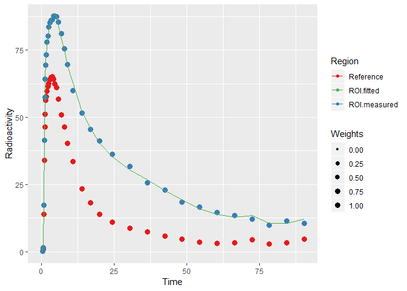
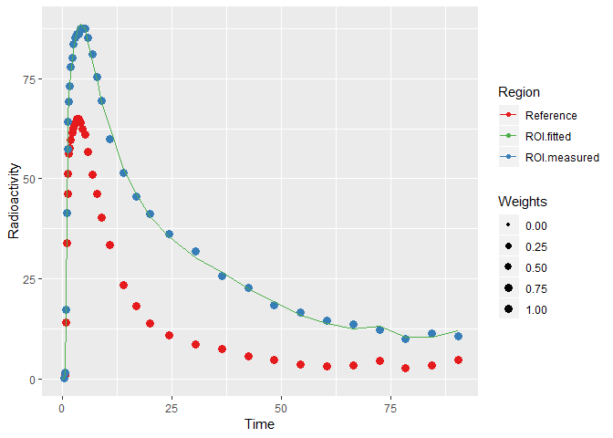
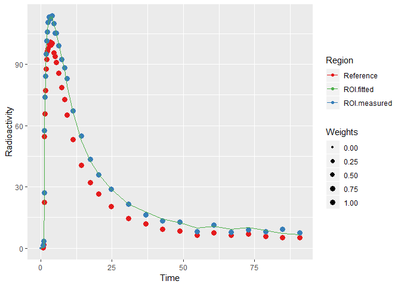

[](https://travis-ci.org/mathesong/kinfitr)
[](https://codecov.io/github/mathesong/kinfitr?branch=master)

# kinfitr : PET Kinetic Modelling using R

## Overview

kinfitr is a package for PET Kinetic Modelling Using R. The main goal of
this package is to make it easier to perform more reproducible research
in PET research. Furthermore, both kinfitr and the language it is
written in, [R](https://cran.r-project.org), are free to download.
Furthermore, the primary IDE for R, [RStudio](https://www.rstudio.com/),
now comes with [R
Notebooks](http://rmarkdown.rstudio.com/r_notebooks.html), which makes
it particularly easy to generate reproducible reports.

## Installation

This package is currently only available on GitHub. It can be downloaded
as follows:

``` r
# install.packages("devtools")  # If you do not already have devtools
devtools::install_github("mathesong/kinfitr")
```

There is also a docker container if you would prefer not to have to
download everything. If you download Docker, you can pull the container
and start it with the following commands:

    docker pull mathesong/kinfitr_docker
    docker run -e PASSWORD=XYZ --name rstudio -p 8787:8787 mathesong/kinfitr_docker

And the the rstudio session can be opened in a browser pointing to
`http://localhost:8787`.

## Usage

### Data Structure

The optimal data structure for *kinfitr* is that of a nested tibble,
with rows representing the desired level of chunking, e.g. whether
modelling be across individuals, or across ROIs within individuals). The
package contains two datasets: `pbr28` containing \[\(^{11}\)C\]PBR28
TACs for testing models involving arterial input function, and `simref`
containing simulated TACs of a tracer with a reference region, for
testing reference tissue models.

``` r
library(tidyverse)
library(kinfitr)
library(knitr)

data(simref)
```

Thus the data looks as follows:

``` r
head(simref)
```

    ## # A tibble: 6 x 4
    ##   Subjname PETNo PET    tacs             
    ##   <chr>    <dbl> <chr>  <list>           
    ## 1 hukw         1 hukw_1 <tibble [38 x 8]>
    ## 2 ybnx         1 ybnx_1 <tibble [38 x 8]>
    ## 3 olyl         1 olyl_1 <tibble [38 x 8]>
    ## 4 rocx         1 rocx_1 <tibble [38 x 8]>
    ## 5 gbiy         1 gbiy_1 <tibble [38 x 8]>
    ## 6 xsqz         1 xsqz_1 <tibble [38 x 8]>

…and inside each nested tibble is the following:

``` r
head(simref$tacs[[1]])
```

    ## # A tibble: 6 x 8
    ##   Times Reference   ROI1    ROI2   ROI3 Weights StartTime Duration
    ##   <dbl>     <dbl>  <dbl>   <dbl>  <dbl>   <dbl>     <dbl>    <dbl>
    ## 1 0         0      0      0       0       0         0        0    
    ## 2 0.567     0.137  0.203  0.0518  0.412   0.712     0.483    0.167
    ## 3 0.733     0.787  1.41   2.31    3.02    0.734     0.65     0.167
    ## 4 0.9      14.0   17.2   15.3    14.1     0.825     0.817    0.167
    ## 5 1.07     34.0   41.5   35.5    35.0     0.901     0.983    0.167
    ## 6 1.23     46.3   57.5   50.7    48.2     0.941     1.15     0.167

### Fitting a Model for a single TAC

As a conscious decision, almost all input arguments of times or
radioactivity concentrations are as numeric vectors. This allows the
functions to be used at any stage of an analysis, and does not require
complicated data structures created in earlier steps. So let’s create
vectors and run a model.

``` r
times <- simref$tacs[[1]]$Times
tac <- simref$tacs[[1]]$ROI1
reference <- simref$tacs[[1]]$Reference
weights <- simref$tacs[[1]]$Weights

srtmfit <- srtm(t_tac = times, reftac = reference,
      roitac = tac,weights = weights)

plot_kinfit(srtmfit)
```

<!-- -->

### Fitting a Model to Many TACs

For many TACs, we can use the fabulous `purrr` package to iterate
through our nested tibble. Let’s also examine how we might decide to
chunk the data, using MRTM1 and MRTM2.

What we want to do from here is to model the data using MRTM1 and MRTM2.
Our plan is as follows:

  - MRTM1 fits BP<sub>ND</sub> and k2’

  - MRTM2 fits BP<sub>ND</sub> (using k2’ from MRTM1 from a high-binding
    region)

So what we’ll do:

  - Fit MRTM1 to one region of each PET Measurement

  - Fit MRTM2 to all regions of each PET Measurement

#### Fitting k2prime using MRTM1 using purrr::map

``` r
simref <- simref %>%
  
  group_by(PET) %>%     # Group by each PET measurement
  
  mutate(mrtm1_fit = map(tacs, ~mrtm1(t_tac = .x$Times, reftac = .x$Reference,      # Add MRTM1 fit column
                                      roitac = .x$ROI1, weights = .x$Weights))) %>%
  
  mutate(k2prime = map_dbl(mrtm1_fit, c('par', 'k2prime')))     # Extract k2prime from the fit output

plot_kinfit(simref$mrtm1_fit[[1]])     # Plot the first TAC
```

<!-- -->

Now we have a k2’ value for each individual from a single region (ROI1).

``` r
head(simref)
```

    ## # A tibble: 6 x 6
    ## # Groups:   PET [6]
    ##   Subjname PETNo PET    tacs              mrtm1_fit k2prime
    ##   <chr>    <dbl> <chr>  <list>            <list>      <dbl>
    ## 1 hukw         1 hukw_1 <tibble [38 x 8]> <mrtm1>    0.0825
    ## 2 ybnx         1 ybnx_1 <tibble [38 x 8]> <mrtm1>    0.119 
    ## 3 olyl         1 olyl_1 <tibble [38 x 8]> <mrtm1>    0.0972
    ## 4 rocx         1 rocx_1 <tibble [38 x 8]> <mrtm1>    0.0934
    ## 5 gbiy         1 gbiy_1 <tibble [38 x 8]> <mrtm1>    0.101 
    ## 6 xsqz         1 xsqz_1 <tibble [38 x 8]> <mrtm1>    0.0923

#### Tidy Data: Gathering into Long format

Now we want to use the k2prime from fitting MRTM1 to one region from
each PET measurement. Now, we want to chunk the data a little bit
differently: we want to make the arrangement a little bit longer: each
TAC which we wish to model should be a row.

``` r
long_simref <- simref %>%
  
  select(-mrtm1_fit) %>% # Remove the fit object
  
  unnest() %>%    # Unnest
  
  select(-StartTime, -Duration) %>% 
  
  gather(Region, TAC, -PET, -Subjname, -PETNo, -Weights, 
         -Times, -k2prime, -Reference) %>%    # Gather the data into long-er format
  
  group_by(PET, Subjname, PETNo, Region, k2prime) %>%    # Group by more than just PET
  
  nest(.key=tacs) %>%       # Nest the data again %>% 

  arrange(Subjname, Region)
```

This produces data which looks like this:

``` r
head(long_simref)
```

    ## # A tibble: 6 x 6
    ##   PET    Subjname PETNo Region k2prime tacs             
    ##   <chr>  <chr>    <dbl> <chr>    <dbl> <list>           
    ## 1 ddgm_1 ddgm         1 ROI1    0.0851 <tibble [38 x 4]>
    ## 2 ddgm_1 ddgm         1 ROI2    0.0851 <tibble [38 x 4]>
    ## 3 ddgm_1 ddgm         1 ROI3    0.0851 <tibble [38 x 4]>
    ## 4 dkkj_1 dkkj         1 ROI1    0.0911 <tibble [38 x 4]>
    ## 5 dkkj_1 dkkj         1 ROI2    0.0911 <tibble [38 x 4]>
    ## 6 dkkj_1 dkkj         1 ROI3    0.0911 <tibble [38 x 4]>

For which the TACs nested object looks like this:

``` r
head( long_simref$tacs[[1]] )
```

    ## # A tibble: 6 x 4
    ##   Times Reference Weights    TAC
    ##   <dbl>     <dbl>   <dbl>  <dbl>
    ## 1 0         0       0      0    
    ## 2 0.617     0.325   0.733  1.52 
    ## 3 0.783     1.29    0.718  0.411
    ## 4 0.95     10.3     0.821 16.4  
    ## 5 1.12     36.2     0.899 42.2  
    ## 6 1.28     49.0     0.933 55.9

#### Fitting MRTM2 using purrr::pmap

Now we can iterate through this list, using the fitted k2prime. We can’t
use `map()` any longer, as we’ll be iterating through 2 lists. For this,
we could either use `map2()`, or we can use `pmap()`, which allows us to
iterate through an unlimited numberof columns. Let’s go with the latter
for now to show how we could do this.

First we define a function for the iteration:

``` r
dofit_mrtm2 <- function(tacs, k2prime) {
  mrtm2(t_tac = tacs$Times, reftac = tacs$Reference, 
            roitac = tacs$TAC, weights = tacs$Weights,
            k2prime = k2prime)
}
```

… and then we apply it:

``` r
long_simref <- long_simref %>%

  mutate(fit_mrtm2 = pmap(list(tacs, k2prime), dofit_mrtm2)) %>%

  mutate(bp_mrtm2 = map_dbl(fit_mrtm2, c('par', 'bp')))


plot_kinfit(long_simref$fit_mrtm2[[6]])
```

<!-- -->

In this way, we can run several different models on the data, keep the
fits in their own separate columns, and plot them at will. And we can do
all of this within the tidyverse paradigm.

## Implemented Models

**Reference Region Models**

  - Simplified Reference Tissue Model (SRTM) *(Lammertsma & Hume, 1996)*

  - Non-Invasive Logan Plot *(Logan et al., 1996)*

  - Non-Invasive Multilinear Logan Plot *(Turkheimer et al., 2003)*

  - Ichise Multilinear Reference Tissue Model 1 (MRTM1) *(Ichise et al.,
    2003)*

  - Ichise Multilinear Reference Tissue Model 2 (MRTM2) *(Ichise et al.,
    2003)*

  - Patlak Reference Tissue Model *(Patlak & Blasberg, 1985)*

**Models Requiring Arterial Input**

  - One-Tissue Compartment Model

  - Two-Tissue Compartment Model

  - Logan Plot *(Logan et al., 1990)*

  - Multilinear Logan Plot *(Turkheimer et al., 2003)*

  - Ichise Multilinear Analysis 1 (MA1) *(Ichise et al., 2002)*

  - Ichise Multilinear Analysis 2 (MA2) *(Ichise et al., 2002)*

  - Patlak Plot *(Patlak et al., 1983)*

**Other Models**

  - Simultaneous Estimation of Non-Displaceable Binding (SIME) *(Ogden
    et al., 2015)*

## To-Do

**General**

  - Vignettes

**Additions**

**Improvements**

  - Tidy up
    
      - Documentation still quite rough and several inconsistencies
    
      - T-star finders have lots of code duplication: should be more
        generic

  - Revise vignette

  - Update plyr functions to dplyr functions

  - Get the package CRAN-ready
